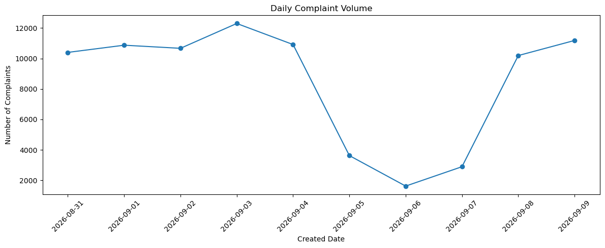
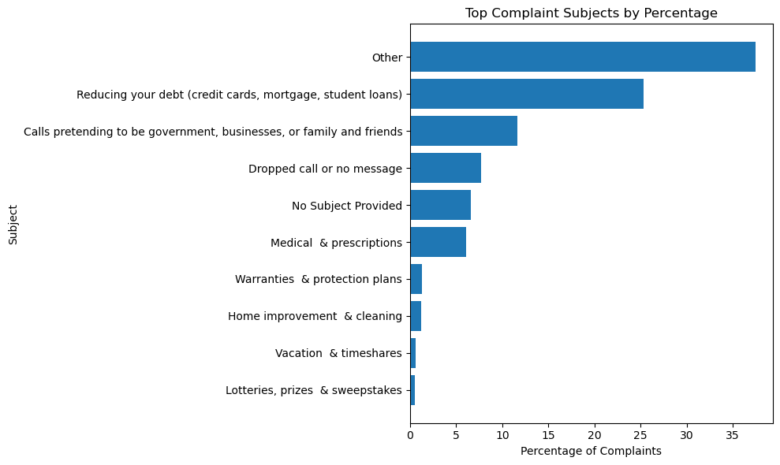
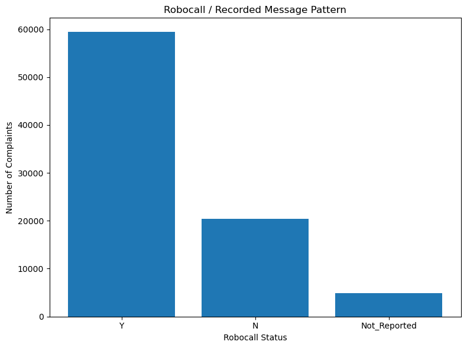
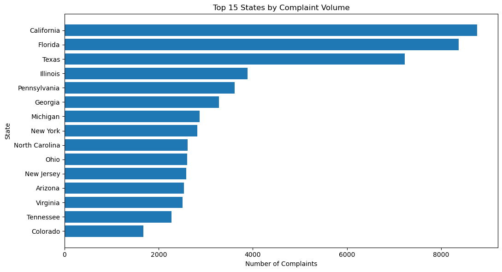
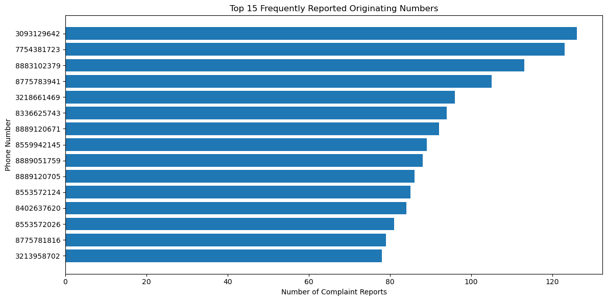
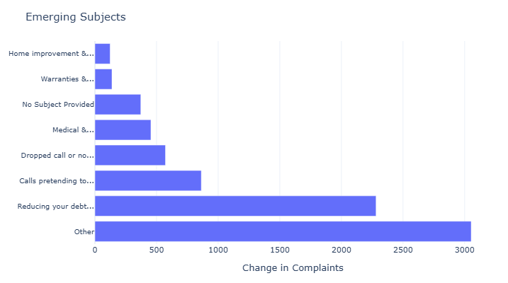
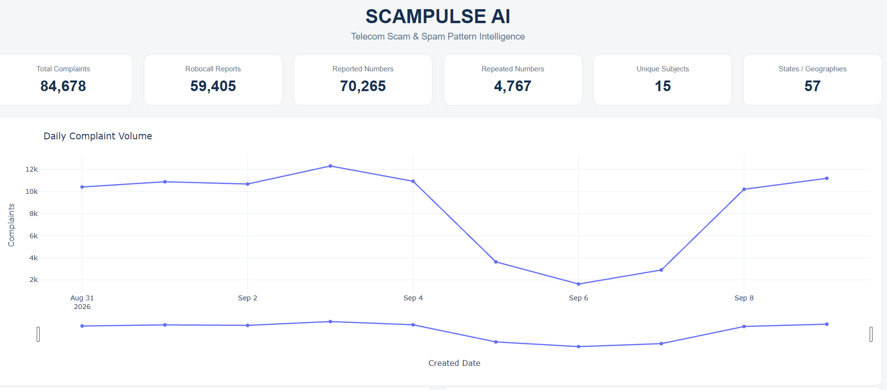
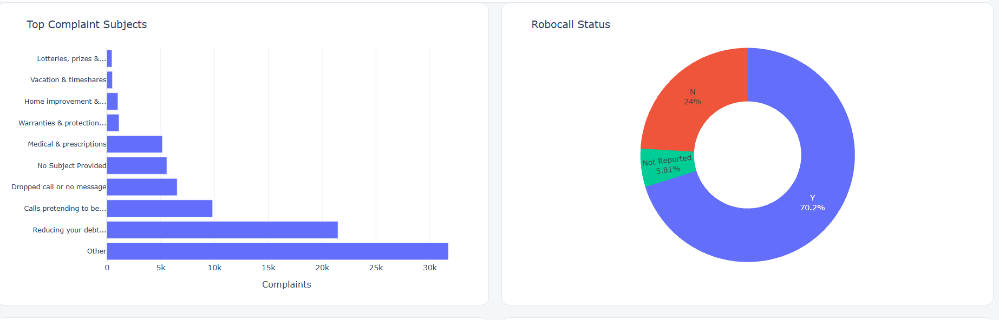
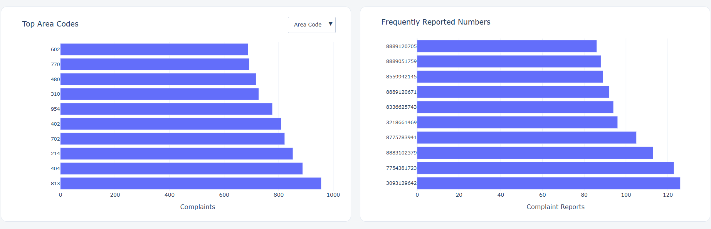
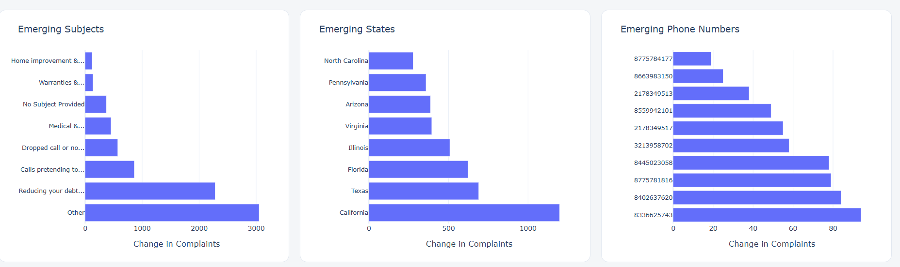

# ScamPulse AI – Telecom Scam & Spam Pattern Intelligence

## Project Overview

**ScamPulse AI – Telecom Scam & Spam Pattern Intelligence** is a Python data analysis project in the **Telecommunications & Artificial Intelligence (AI) / Data Analytics** domain.

The project analyzes consumer-reported telecom complaint records to identify recurring and emerging unwanted-call patterns across time, complaint subjects, robocall status, geography, and originating phone numbers.

The current **Sprint 1** scope focuses on **data analysis and intelligence generation**, not a final scam classifier.

---

## Industry

**Telecommunications & Artificial Intelligence (AI) / Data Analytics**

---

## Problem Statement

Telecom users are continuously exposed to unwanted calls, robocalls, spam calls, and potentially fraudulent calls. Large-scale consumer complaint data contains important patterns across time, complaint subjects, robocall status, geography, and originating phone numbers, but these patterns are difficult to identify manually.

ScamPulse AI analyzes consumer-reported complaint records to identify recurring and emerging unwanted-call patterns and provide analytical intelligence that can support telecom call-protection and future spam/scam detection initiatives.

---

## Proposed Solution

ScamPulse AI uses **Python, Pandas, NumPy, Matplotlib, and Plotly** to clean, analyze, and visualize telecom complaint data.

The project follows a structured data-analysis workflow to transform complaint records into analytical information that can be explored through static visualizations and an interactive Plotly dashboard.

### Analysis Questions

The project focuses on the following questions:

1. How does complaint volume change over time?
2. Which complaint subjects are most frequently reported?
3. What proportion of reports are associated with recorded messages/robocalls?
4. Which states, cities, and area codes have higher complaint volumes?
5. Which originating phone numbers are repeatedly reported?
6. Which subjects, states, and phone numbers show recent increases in complaint activity?
7. What patterns can support future spam/scam monitoring and machine-learning development?

---

## Dataset

### Dataset Name

**FTC Do Not Call (DNC) Reported Calls Data**

### Dataset Source

**U.S. Federal Trade Commission (FTC) – Do Not Call (DNC) Reported Calls Data**

The project uses consumer-reported complaint records for analysis.

---

## Project Workflow

The project follows this workflow:

```text
Industry Selection
        ↓
Problem Identification
        ↓
Dataset Collection
        ↓
Data Cleaning
        ↓
Data Transformation
        ↓
Data Analysis
        ↓
Data Visualization
        ↓
Insights
        ↓
Recommendations
```

---

## Data Analysis & Visualization

The project performs the following analyses based on the actual Sprint 1 workflow:

### Dataset Overview
- Total complaint records
- Unique complaint subjects
- Unique states/geographies
- Unique cities
- Distinct reported originating phone numbers
- Robocall reports

### Temporal Analysis
- Daily complaint volume
- Daily percentage change
- 3-day rolling average

### Time-based Analysis
- Complaint activity by hour
- Complaint activity by day of week

### Category-wise Analysis
- Complaint subject counts
- Top complaint subjects
- Complaint subject percentage share

### Robocall Analysis
- Robocall / recorded-message status counts
- Daily robocall / recorded-message trend
- Complaint subjects by robocall status

### Geographic Analysis
- Complaint volume by state
- Top states by complaint volume
- States by robocall status
- City complaint counts
- Consumer area-code analysis

### Originating-Number Analysis
- Frequently reported originating numbers
- Repeated originating-number counts
- Phone number × complaint subject analysis

### Comparison Analysis
- Top complaint subjects across top states

### Reporting-Delay Analysis
- Reporting-delay quality review
- Valid reporting-delay distribution

### Emerging-Pattern Analysis
Recent available dates are compared with the previous available dates to identify increases in:
- Complaint subjects
- States
- Originating phone numbers

### Multi-dimensional Analysis
- State × Subject × Robocall pattern analysis

### Interactive Visualization
The project includes a **Plotly-based interactive dashboard** containing:
- KPI summary
- Daily complaint volume
- Top complaint subjects
- Robocall status
- Geographic views for State, City, and Area Code
- Frequently reported originating numbers
- Emerging Subjects
- Emerging States
- Emerging Phone Numbers

---

## Key Insights

The actual analysis produced the following findings:

1. **Complaint volume varies sharply by date.**  
   The highest observed complaint volume was **12,296 reports on 2026-09-03**, while the lowest observed daily volume was **1,628 reports on 2026-09-06**.

2. **The `Other` complaint category was the leading category.**  
   It accounted for **31,724 reports (37.5%)** of the processed records.

3. **Robocall-related activity was substantial.**  
   The dataset contained **59,405 robocall reports**, representing **70.2%** of the processed records.

4. **Complaint activity was geographically concentrated.**  
   **California** was the leading state by complaint volume in the analysis.

5. **Originating-number recurrence was present.**  
   The analysis identified **70,265 distinct reported originating numbers**, with **4,767 numbers reported more than once**.

6. **Recent increases were visible across subjects, states, and originating numbers.**  
   In the recent-versus-previous comparison, the leading increases included:
   - `Other`: **+3,053 reports**
   - California: **+1,198 reports**
   - `8336625743`: **+94 reports**

### Interpretation Note

Emerging patterns and repeated complaint reports are treated as **monitoring signals**, not confirmation that a specific originating number is fraudulent.

---

## Recommendations

Based only on the observed findings, the project supports the following practical recommendations:

1. **Use time-based monitoring** because complaint activity shows substantial variation across dates.

2. **Prioritize dominant complaint categories** for monitoring because a small number of subjects contribute a large share of complaint activity.

3. **Monitor robocall-related activity closely** because recorded-message/robocall reports represent a substantial portion of the analyzed records.

4. **Use geographic concentration for monitoring and prioritization** by tracking states, cities, and area codes with higher complaint volumes.

5. **Prioritize repeated and emerging originating numbers for further review** because recurrence and recent increases can help focus investigation and monitoring efforts.

6. **Use the Sprint 1 analytical results as a foundation for future machine-learning development**, including future work on anomaly detection, risk scoring, and spam/scam classification.

---

## Visualization Screenshots

The following visualization files represent the actual visual outputs used for the project.

### Daily Complaint Volume



### Complaint Subjects



### Robocall Analysis



### Geographic Analysis



### Frequently Reported Numbers



### Emerging Subjects



### Emerging State


### Emerging Phone Numbers


## Interactive Dashboard

The project includes a standalone Plotly dashboard:






The dashboard brings together the project's KPI summary and interactive visualizations for temporal, subject, robocall, geographic, originating-number, and emerging-pattern analysis.

---

## Technologies Used

- Python
- Pandas
- NumPy
- Matplotlib
- Plotly
- Jupyter Notebook

---

## Project Folder Structure

```text
ScamPulse-AI/
│
├── README.md
│
├── Dataset/
│   ├── raw_dataset.csv
│   └── cleaned_dataset.csv
│
├── Notebook/
│   └── ScamPulse_AI_Complete_Project.ipynb
│
├── Python/
│   ├── data_loading.py
│   ├── data_cleaning.py
│   ├── exploratory_analysis.py
│   └── data_visualization.py
│
├── Visualizations/
│   ├── daily_complaint_volume.png
│   ├── complaint_subjects.png
│   ├── robocall_analysis.png
│   ├── geographic_analysis.png
│   ├── reported_numbers.png
│   ├── emerging_subjects.png
│   ├── emerging_states.png
│   ├── emerging_phone_numbers.png
│   ├── dashboard_op1.png
│   ├── dashboard_op2.png
│   ├── dashboard_op3.png
│   ├── dashboard_op4.png
│   └── ScamPulse_AI_Dashboard.html
│
└── Documentation/
    └── Project_Report.pdf
```

---

## Current Sprint 1 Scope

The current implementation focuses on:

```text
Data Understanding
        ↓
Data Quality
        ↓
Data Cleaning
        ↓
Exploratory Data Analysis
        ↓
Interactive Dashboard
```

The project does **not** implement a final scam-classification model in Sprint 1.

The analysis instead provides a structured foundation for future machine-learning development.

---

## Author

**Name:** VELAVAN P D  
**Student ID:** AF05320062  
**Organization:** Anudip Foundation  
**Course:** AIML  
**Batch Code:** ANP - D7444
